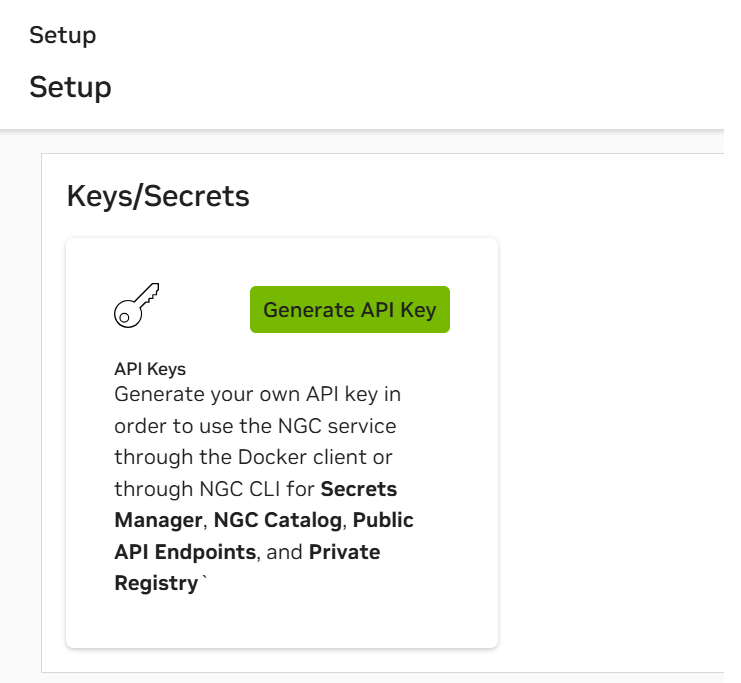

<<<<<<< HEAD
Arrow's Digital Human Baremetal Deployment 
=======
# Arrow Digital Human Baremetal Deployment 

This is a step-by-step instruction for deploying NVIDIA ACE Digital Human project on baremetal. Our team at Arrow Electronics ECS was able to deploy this project on a 2xA6000 workstation. The purpose of this documentation is to provide solutions and troubleshooting tips for common errors experienced during deployment. 


## 1. Hardware & OS Requirements

According to [ACE documentation](https://docs.nvidia.com/ace/latest/workflows/tokkio/text/deployment/BareMetal-setup.html) this project needs two instances named **App** and **Controller** with the following OS and hardware **minimum** requirements:

###  **App Instance**:

* **Description**: This is the main server that is going to run all the backend microservices.
* **OS**: Ubuntu 22.04 
* **Hostname Requirements**:
    * Contains only lowercase letters (a-z), digits (0-9), and hyphens (-)
    * Begins and ends with an alphanumeric character 
    * Be at most 253 characters long
    * Refer to troubleshooting section to set/change the hostname
* **Hardware**: 
    * **GPU**: 

        * **NVIDIA T4**, **A10**, **L4**,  **L40S** 
    
        * **1 stream of Digital Avatar**: **2 GPUs** (eg: LLM-RAG-ov-**1** application) 
        * **3 streams of Digital Avatar**: **4 GPUs**  (eg: LLM-RAG-ov-**3** application)
    * **CPU**: 8 cores 
    * **RAM**: 64GB 
    * **Storage**: 300GB on ```/opt``` folder & 400 GB ```/var/lib/containerd``` ~ minimum 700 GB 


### **Controller Instance**: 
* **Description**: This is the device where we launch the scripts from. 
* **OS**: Ubuntu 22.04 
* **Minimum Hardware**:  No GPU is needed, a simple Linux laptop will do.


## 2. Get NVIDIA AI Enterprise License

**NVIDIA AI Enterprise(NVAIE) License** is a **must** for this deployment. 

If you are currently an Arrow partner, talk to your channel manager about obtaining an NVAIE license.

Make sure you have access to NGC portal and its organization type is **Enterprise** under Organization Profile.

Follow the steps below to obtain the API keys required for this project: 

1. Login to [NGC Portal](https://ngc.nvidia.com/signin) and select the Enterprise licensed organization
2. On the top right corner, navigate to **Setup**
3. Under **Keys/Secrets**,
    * Click on **Generate API Key** and store the key in a safe place. This key is both your ```NGC_CLI_API_KEY``` and ```NVIDIA_API_KEY``` in step 6.

## 3. Configure Passwordless Sudo Access on each Device: 

Within this deployment, root access is required for all users to run commands without prompting for a password. Edit the ```/etc/sudoers``` file using the following steps to enable this feature:

1. Run ```sudo visudo``` to open the file.

2. Navigate to section defining privileges of users in group ```sudo``` and insert the following line:
    
        ALL	 	ALL=ALL(ALL) NOPASSWD:ALL 
3. Repeat for each device.

## 4. Setup SSH Key Pair and Authentication between Instances

Using the following commands, setup SSH Key Pair between the Controller and App Instances:

1. On the Controller Instance, generate a secure 4096-bit RSA Key Pair with the following command and note the stored file locations:

        ssh-keygen -t rsa -b 4096 -C "replace_with_your_label"

2. Copy the Public Key to the Application Server:
       
        ssh-copy-id user@server_ip

## 5. Clone ACE Repository from Git onto the Controller

Ensure that Git is installed and clone the repository onto the Controller instance and navigate to baremetal directory.

    git clone https://github.com/NVIDIA/ACE.git
    cd ACE/workflows/tokkio/scripts/one-click/baremetal

## 6. Edit Config files and Environment Variables

Two files are required to begin deploying your Digital Human. From the baremetal directory, use the ```config-template-examples/llm-ov-3d-coturn-1x-stream``` directory to copy the example files over to your baremetal directory. These will be used as a template and require further edits.

    cp config-template-examples/llm-ov-3d-coturn-1x-stream/my-config.env my-config.env
    cp config-template-examples/llm-ov-3d-coturn-1x-stream/config-template.yml config.yml

Within the baremetal directory, navigate to the file ```my-config.env```. Open the file using your preferred text editor and fill in keys according to each specified variable name.

    export OPENAI_API_KEY="<replace-with-actual-value>"
    export NGC_CLI_API_KEY="<replace-with-actual-value>"
    export NVIDIA_API_KEY="<replace-with-actual-value>"

For the ```OPENAI_API_KEY```, head over to [OpenAI Keys](https://platform.openai.com/api-keys) and generate a key. 

***Note:*** OpenAI follows a pay-as-you-go model, so be aware of API usage and monitor costs.

For the ```NGC_CLI_API_KEY``` and ```NVIDIA_API_KEY```, use the key created after selecting "Generate API Keys" in the setup section of NGC.



    export APP_HOST_IPV4_ADDR="<replace-with-actual-value>"
    export APP_HOST_SSH_USER="<replace-with-actual-value>"
    export COTURN_HOST_IPV4_ADDR="<replace-with-actual-value>"
    export COTURN_HOST_SSH_USER="<replace-with-actual-value>"

We used the same values for both ```APP_HOST``` and ```COTURN``` IPV4 and SSH user values. 

## 7. Complete config.yaml File

On line 2, name your digital human. 

    name: '<replace-with-unique-deployment-name>'

Next, find the line corresponding to the SSH Public and Private Key path. Fill in the lines with the correct path to the key with respect to the home directory. In our case, the paths were as follows:

    ssh_public_key: "{{ lookup('file', lookup('env', 'HOME') + '/.ssh/id_rsa.pub') }}"
    ssh_private_key_path: "{{ lookup('env', 'HOME') + '/.ssh/id_rsa' }}"

Ensure that you have the proper ```helm_chart``` settings by specifying ```enable: true```,  ```repo_url```, ```chart_name```, ```chart_version```, and ```release_name```:

    app:
        configs:
        app_settings:
            k8s_namespace: 'app'
            helm_chart:
            repo:
                enable: true
                repo_url: 'https://helm.ngc.nvidia.com/nvidia/ace'
                chart_name: 'ucs-tokkio-app-base-1-stream-llm-rag-3d-ov'
                chart_version: '4.1.4'
                release_name: 'tokkio-app'

***Note:*** Specify the number of streams under ```chart_name``` according to the minimum hardware available for your deployment. Additionally, make sure ```chart_version``` is specified to ``` '4.1.4' ``` for ```schema_version: '0.0.7'```.


You can change the name of the app by changing ```APP_TITLE``` under ```ui_settings```: 

    ui_settings:
            user_env_vars:
                APP_TITLE: '<name-of-your-app>'
                APPLICATION_TYPE: "custom"
                
## 8. Install Prerequisites

Run the following command in the correct directory to install required packages: 

    bash -v prerequisites.sh

if you have problem with installing Terraform refer to section Common Errors ?? 

## 9. Run the One-Click Script

To start the baremetal deployment first you need to initialize all your environment variables in the ``.env`` file by running the following command in the baremetal directory: 
    
    source <name-of-your-config-env-file>.env 

Now, you can run the following the install command in the same directory: 

    bash -v ./envbuild.sh install all  --component all  --config-file ./<name-of-your-config-yml-file>.yml  

Let the script run. The script portion may take approximately 15-20 minutes. After that, a few hours later, the Kubernetes pods will start. You can check the status of the kubernetes pods by running: 

    Kubectl get po -n app 

***Note:*** If ubuntu firewall is enabled, ensure that port 80 is allowed.

    sudo ufw allow 80

To access the UI via Chrome, configure flags in settings using the following steps: 


1. Open a Chrome browser and navigate to:

        chrome://flags/#unsafely-treat-insecure-origin-as-secure 

2. There, select Enable and use the following chrome flags replaced with the actual IP:

        http://<your-app-instance-ip>:80, 
        http://<your-app-instance-ip>:30888,  
        ws://<your-app-instance-ip>:30888

Refresh Chrome, and access the UI using your ip at port 80:

    http://<your-app-instance-ip>:80

## 10. Troubleshoot & Debugging


### 10.1. While installing prerequisites Terraform failed


1. Downloaded Binary (v1.5.7) from [Terraform](https://developer.hashicorp.com/terraform/install) 

2. Unzip terraform.zip 

3. Move terraform binary to executables directory:

    ```sudo mv ./Downloads/terraform/terraform /usr/bin```

### 10.2 Kubernetes Pods fail to start

Run this command to restart the Kubernetes pods.

    kubectl rollout restart deployment -n app
Alternatively, run this command if still facing errors.

    kubectl delete pods --all -n app

### 10.3 The Digital Human avatar starts, greets you and says his name is Taylor but says he is having "technical difficulties"

Verify that you have the correct license and sufficient credits through the NVIDIA portal.
>>>>>>> bfaac66 (Added README.md)
### 10.4 Kubernetes doesn't like my hostname

Run one of these commands to change your App server's hostname

    sudo hostnamectl set-hostname <lowercase-hostname>
    sudo reboot 
Or edit the hostname under ```etc/hostname```: 
    
    sudo nano etc/hostname 
    sudo reboot 